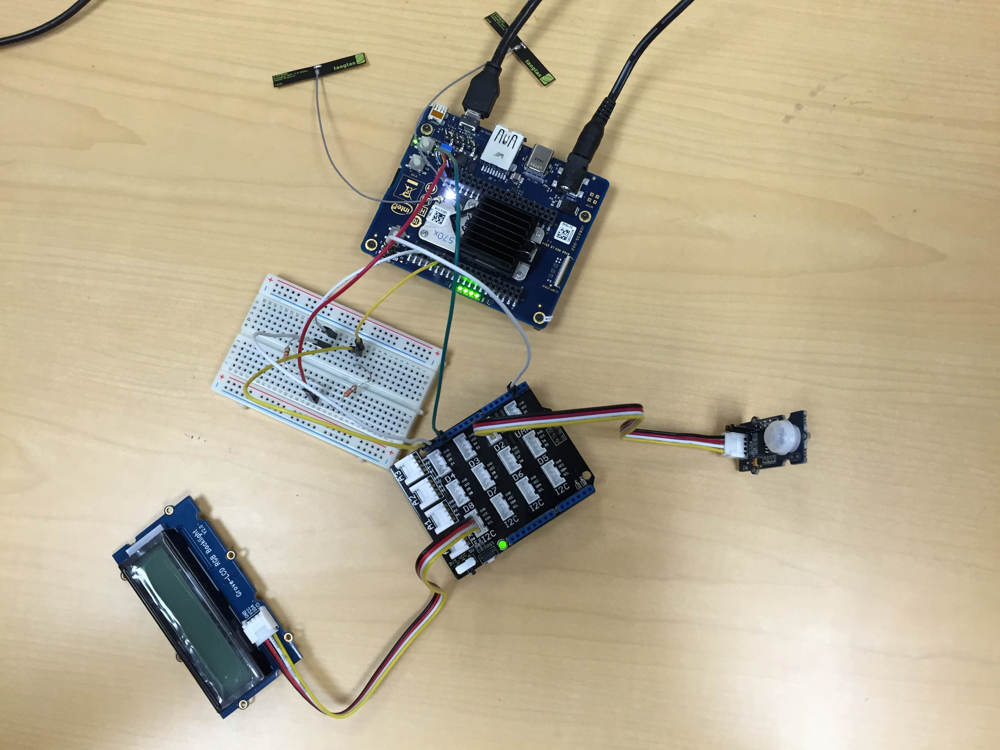
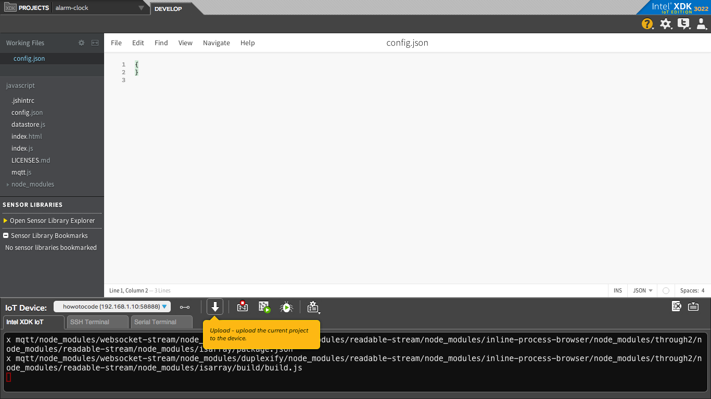
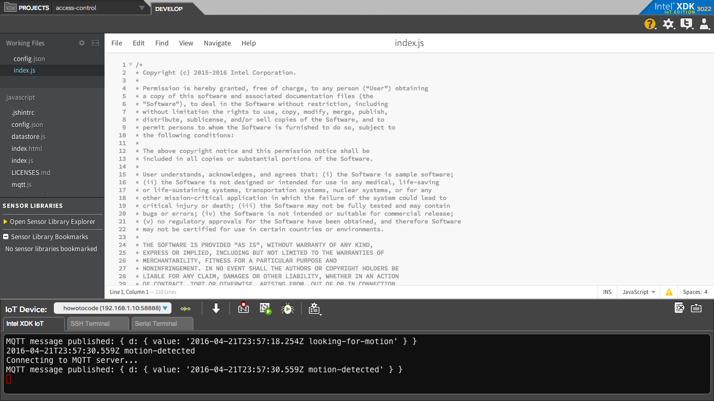
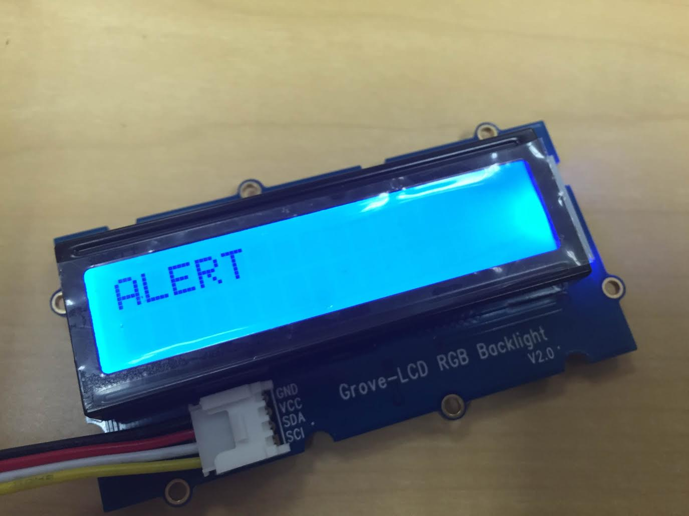
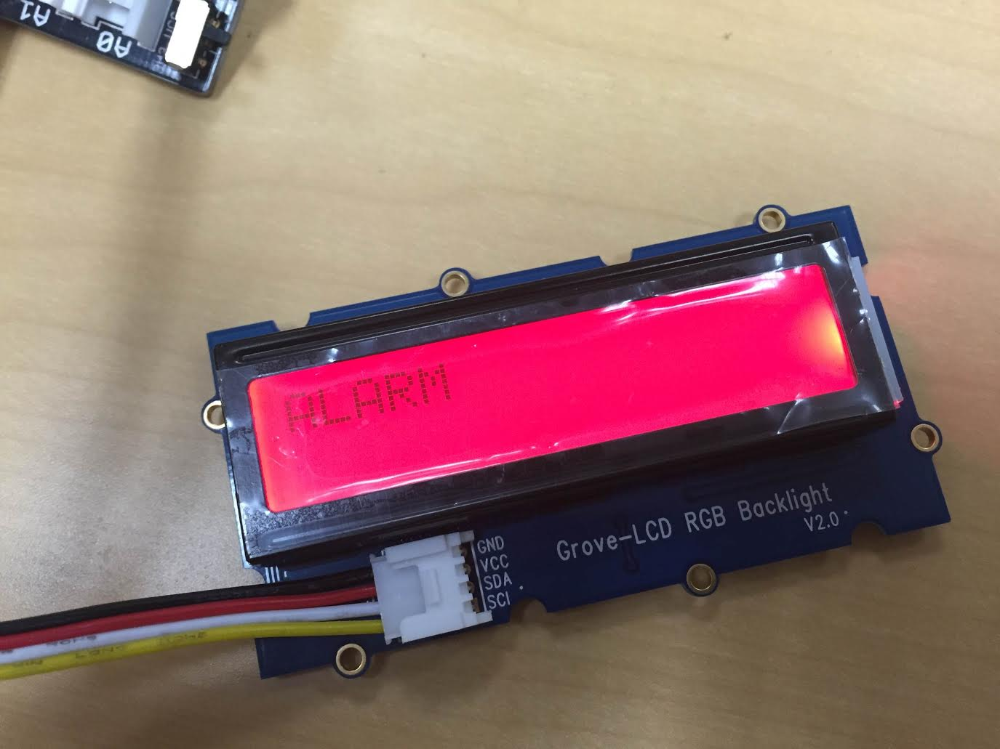
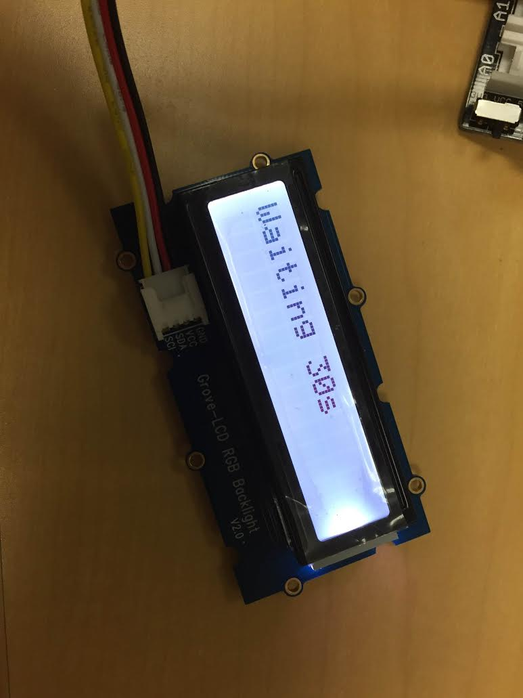

# Access control in javascript*

## Introduction

This access control system application is part of a series of how-to Intel® Internet of Things (IoT) code sample exercises using the Intel® IoT Developer Kit, Intel® Joule Expansion Board development platform, cloud platforms, APIs, and other technologies.

From this exercise, developers will learn how to:<br>
- Connect the Intel® Joule Expansion Board development platform, a computing platform designed for prototyping and producing IoT and wearable computing products.<br>
- Interface with the Intel® Joule Expansion Board platform IO and sensor repository using MRAA and UPM from the Intel® IoT Developer Kit, a complete hardware and software solution to help developers explore the IoT and implement innovative projects.<br>
- Run this code sample in the Intel® XDK IoT Edition, an IDE for creating applications that interact with sensors and actuators, enabling a quick start for developing software for the Intel® Joule Expansion board or from the Intel® Galileo board.<br>
- Set up a web application server to let users enter the access code to disable the alarm system and store this alarm data using Azure Redis Cache\* from Microsoft\* Azure\*, Redis Store\* from IBM\* Bluemix\*, or ElastiCache\* using Redis\* from Amazon Web Services\* (AWS), different cloud services for connecting IoT solutions including data analysis, machine learning, and a variety of productivity tools to simplify the process of connecting your sensors to the cloud and getting your IoT project up and running quickly.
- Set up a MQTT-based server using IoT Hub from Microsoft\* Azure\*, IoT from IBM\* Bluemix\*, or IoT from Amazon Web Services\* (AWS), different cloud machine to machine messaging services based on the industry standard MQTT protocol.


## What it is

Using an Intel® Joule Expansion board, this project lets you create a smart access control system that:<br>
- monitors a motion sensor to detect when a person is in an area that requires authorization.<br>
- can be accessed with your mobile phone via the built-in web interface to disable the alarm.<br>
- keeps track of access, using cloud-based data storage.

## How it works

This access control system provides the following user flow:

1. Passive infrared (PIR) motion sensor looks for motion.
2. User sets off the motion detector and has 30 seconds to enter the correct code in the browser.
3. If the user fails to enter the code in the given time, the alarm goes off.
4. If the user enters the correct code, the system waits for 30 seconds before allowing the user to pass.

Additionally, various events (`looking-for-motion`, `motion-detected`, `invalid-code`, etc.) are logged.

Optionally, all data can be stored using the Intel® IoT Examples data store or an MQTT server running in your own Microsoft\* Azure\*, IBM\* Bluemix\*, or AWS account.

## Hardware requirements

Grove* Transportation and Safety Kit containing:

1. Intel® Joule Expansion Board with a Grove\* Base Shield
2. [Grove\* PIR Motion Sensor](http://iotdk.intel.com/docs/master/upm/node/classes/biss0001.html)
3. [Grove\* RGB LCD](http://iotdk.intel.com/docs/master/upm/node/classes/jhd1313m1.html)
4. 3.3 k-ohm resistors (2)
5. Bunch of male to male jumper wires

## Software requirements

1. Intel® XDK IoT Edition
2. Microsoft\* Azure\*, IBM\* Bluemix\*, or AWS account (optional)

### How to set up

To begin, the project already exists as a template in the Intel® XDK IoT Edition. You can follow the following steps to set it up.

1. Under "START A NEW PROJECT" (to the left of the screen), click on Templates
2. Now select "Access Control" (more to the centre and the right of the screen) as the template that you want to try out.
3. Now, click on continue at the bottom of the screen.
4. This will prompt you to enter a Project Name and also provide you with an option to change the project directory. Enter a project name here.
5. Now it prompts you to take a tour of XDK, up to you if you want to take a tour.
6. Now you have the code in front of you and you can play around with it as you please.

You need to connect to your Intel® Joule Expansion Board from your computer to send code to it.


Click the **IoT Device** menu at the bottom left. If your Intel® Joule Expansion Board is automatically recognized, select it.


Otherwise, select **Add Manual Connection**.
In the **Address** field, type the ip address of your Intel® Joule Expansion Board.
In the **Port** field, type `58888`.
Click **Connect** to save your connection.

### Connecting the Grove\* sensors



You need to have a Grove\* Shield connected to the Intel® Joule Expansion Board correctly. Make sure you have the tiny VCC switch on the Grove\* Shield set to **5V**.
The pin mapping for the Intel® Joule Expansion Board is not the same as for the Edison or Galileo board. The Intel® Joule Expansion Board has 2 breakouts which each having 40 pins. You also have access to 4 onboard LEDs. The following are the instructions for hooking up the Access Control circuitry.

1. Pin-1 on Breakout-1 is used for the GPIO based sensor here, connect this pin to the D2 pin on the Grove\* base shield and plug one end of a Grove\* cable connected to the Grove/* PIR motion sensor into the D2 port on the base shield.
2. Pin 1 on breakout-2 is the ground pin and Pin 2 can be used to provide the 5V connection. Connect both these pins to the respective pins on the Grove/* Base Shield.
3. Pins 11 and 13 are I2C0SDA and I2C0SCL respectively and are used for I2C bus, these are again on Breakout-1. Plug these pins into a bread board where you would have to create a pull up circuit. This pull up circuit is necessary for the LCD to work. You would be pulling up the voltage on these lines to 5V. You can create this using 2 3.3k-ohm resistors.


4. Plug the other end of the wires from the pull up circuit into the SDA and SCL lines on the Grove\* Base Shield and connect a Grove\* connector cable to connect the RGB LCD to one of the I2C ports on the Grove\* Base Shield.

### Microsoft\* Azure\* server setup

Optionally, you can store the data generated by this sample program in a back-end database deployed using Microsoft\* Azure\*, IBM\* Bluemix\*, or AWS, along with Node.js\*, and a Redis\* data store.

For information on how to set up your own cloud data server, go to:

[https://github.com/intel-iot-devkit/intel-iot-examples-datastore](https://github.com/intel-iot-devkit/intel-iot-examples-datastore)

### MQTT server setup

You can also optionally store the data generated by this sample program using MQTT, a machine-to-machine messaging server. You can use MQTT to connect to Microsoft\* Azure\*, IBM\* Bluemix*, or AWS.

For information on how to connect to your own cloud MQTT messaging server, go to:

[https://github.com/intel-iot-devkit/intel-iot-examples-mqtt](https://github.com/intel-iot-devkit/intel-iot-examples-mqtt)

## Configuring the example

To configure the example for the optional Microsoft\* Azure\*, IBM\* Bluemix\*, or AWS data store, add the `SERVER` and `AUTH_TOKEN` keys in the `config.json` file below the "CODE" key as follows:

```
{
  "CODE": "4321",
  "SERVER": "http://intel-examples.azurewebsites.net/logger/access-control",
  "AUTH_TOKEN": "s3cr3t"
}
```

For information on how to configure the example for the optional Microsoft\* Azure\*, IBM\* Bluemix\*, or AWS MQTT messaging server, go to:

[https://github.com/intel-iot-devkit/intel-iot-examples-mqtt/](https://github.com/intel-iot-devkit/intel-iot-examples-mqtt/)

This example uses a server hosted on the Intel Joule Expansion board. You will be able to host the server on the board without any significant problems, however, in order to be able to access the application hosted by the server you would need to unblock the ports on the board.

To do that, please run the following commands:

	$ iptables –F
	$ iptables –P INPUT ACCEPT
	$ iptables –P FORWARD ACCEPT
	$ iptables –P OUTPUT ACCEPT
	$ iptables –S
	
## Code Changes required for the Intel® Joule Expansion Board

There are no code changes required to run this example on the Intel® Joule Expansion Board. However, you would have to change the pin number passed into the constructors of each of the sensor modules that have been initialized.

1. For the Grove\* PIR Motion Sensor, please pass in the pin number 1, this is because you are using pin-1 on breakout-1 on the Intel® Joule Expansion Board.
	var motion = new mymotion.BISS0001(1);

2. For I2C RGB LCD, please pass in Bus number 0, there are 3 available I2C buses on the Intel® Joule Expansion Board; we are using only 1 for this example. These buses are numbered 0, 1, 2 and are available on the pins: 11, 13, 15, 17, 19, 21. We will be using pins 11 and 13.
	var screen = new myscreen.Jhd1313m1(0, 0x3E, 0x62);

## Running the program using Intel® XDK IoT Edition

When you're ready to run the example, make sure you saved all the files.



Click the **Upload** icon to upload the files to the Intel® Joule Expansion Board.


Click the **Run** icon at the bottom of Intel® XDK IoT Edition. This runs the code on the Intel® Joule Expansion Board.


If you made changes to the code, click **Upload and Run**. This runs the latest code with your changes on the Intel® Joule Expansion Board.



You will see output similar to the above when the program is running.

### Disabling the alarm


The alarm is disabled using a single-page web interface served directly from the Intel® Joule Expansion Board while the sample program is running.

The web server runs on port `3000`, so if the Intel® Joule Expansion Board is connected to Wi-Fi\* on `192.168.1.13`, the address to browse to if you are on the same network is `http://192.168.1.13:3000`.







### Determining the Intel® Joule Expansion Board's IP address

You can determine what IP address the Intel® Joule Expansion Board is connected to by running the following command:

    ifconfig
 
You will see output similar to the following:

    wlp1s0    Link encap:Ethernet  HWaddr A4:34:D9:06:A1:F8
			  inet addr:192.168.1.137  Bcast:192.168.1.255  Mask:255.255.255.0
			  inet6 addr: fe80::a634:d9ff:fe06:a1f8%119/64 Scope:Link
			  UP BROADCAST RUNNING MULTICAST  MTU:1500  Metric:1
			  RX packets:39 errors:0 dropped:0 overruns:0 frame:0
			  TX packets:61 errors:0 dropped:0 overruns:0 carrier:0
			  collisions:0 txqueuelen:1000
			  RX bytes:6288 (6.1 KiB)  TX bytes:13215 (12.9 KiB)


The IP address is shown next to `inet`. In the example above, the IP address is `192.168.1.137`.

IMPORTANT NOTICE: This software is sample software. It is not designed or intended for use in any medical, life-saving or life-sustaining systems, transportation systems, nuclear systems, or for any other mission-critical application in which the failure of the system could lead to critical injury or death. The software may not be fully tested and may contain bugs or errors; it may not be intended or suitable for commercial release. No regulatory approvals for the software have been obtained, and therefore software may not be certified for use in certain countries or environments.
