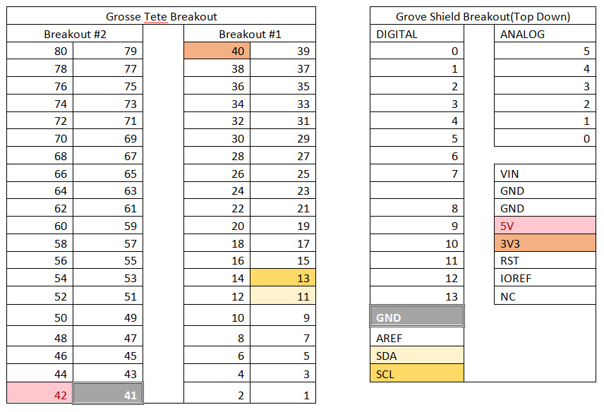
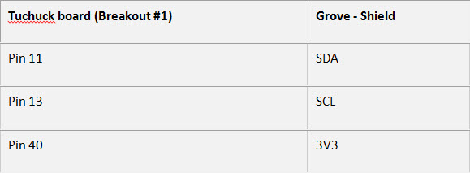
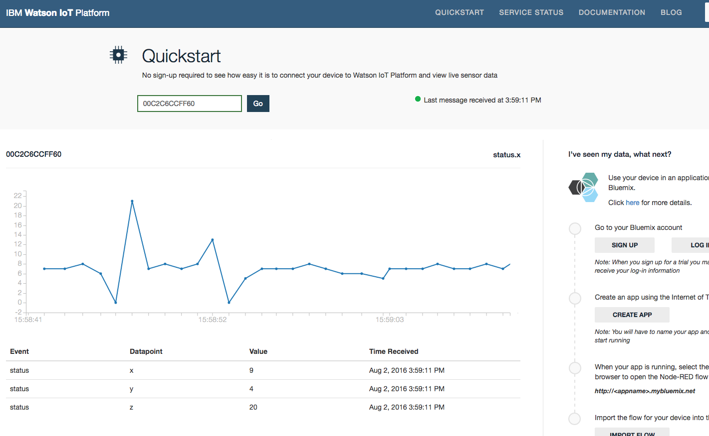

# BLE station with GT

## Introduction
This BLE station example publishes accelerometer data and temperature and humidity from a TI SensorTag to the IBM Bluemix IoT cloud..

## Required Hardware
* TI SensorTag (CC2650), make sure it is turned on
* Grove Shield
* Grove LCD
* Grove 3-axis accelerometer
* 5 male to male wires

## Setup
* Ensure that your GT has been updated with the latest build of Ostro-GT
* Ensure that your GT has internet access after setting up WiFi (i.e. using connman)
* Ensure that Bluetooth has been enabled by using the command:
```
rfkill unblock bluetooth
```

Here is the hardware setup:

Connect male to male wires from the headers on the GT to the grove shield, as shown below






Then plug in the LCD screen to the grove shield on the I2C connector closest to the A0 connector, and the 3-axis accelerometer to the second I2C port. **make sure you turn your board off and on , I2C only detects on boot, so if you don't turn on your board with the LCD and accelerometer plugged in it won't detect them** You need to connect them in this order because the GT board does not have pull up resistors, and the 3-axis accelerometer has them.


The full setup should look like this


## Running the code
You can launch this project from XDK (after first importing it from XDK IoT Edition), or run it directly on your device:

```
npm install
node index.js
```


## IBM Bluemix IoT
Go to [IBM IoT Quickstart](https://quickstart.internetofthings.ibmcloud.com/#/) and enter your device ID to visualize your accelerometer data.

In order to change your device ID, see the Set your Device ID section of the IBM Quickstart Javascript tutorial https://github.com/intel-iot-devkit/GT_IDF_code_samples/tree/master/ibm-quickstart-javascript#set-your-device-id



