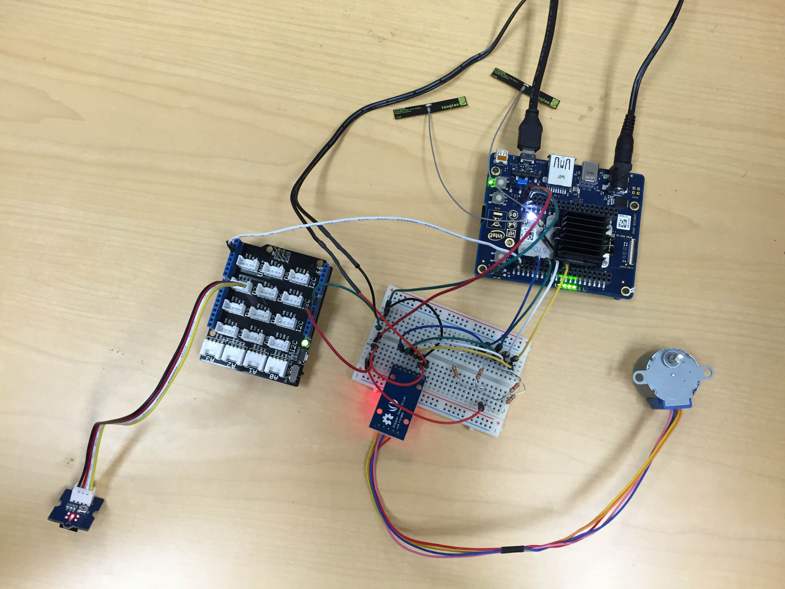
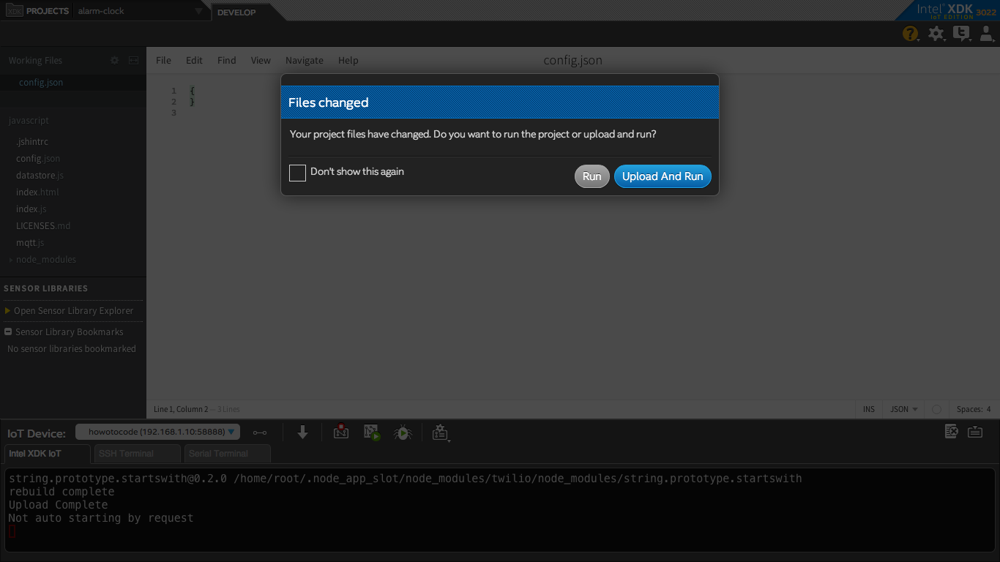

# Range finder scanner in JavaScript*

## Introduction

This range finder scanner application is part of a series of how-to Intel® IoT code sample exercises using the Intel® IoT Developer Kit, Intel® Joule Expansion Board development platform, cloud platforms, APIs, and other technologies.

From this exercise, developers will learn how to: 
- Connect the Intel® Joule Expansion Board development platform, a computing platform designed for prototyping and producing IoT and wearable computing products. 
- Interface with the Intel® Joule Expansion Board platform IO and sensor repository using MRAA and UPM from the Intel® IoT Developer Kit, a complete hardware and software solution to help developers explore the IoT and implement innovative projects. 
- Run this code sample in Intel® XDK IoT Edition, an IDE for creating applications that interact with sensors and actuators, enabling a quick start for developing software for the Intel® Joule Expansion Board. 
- Set up a web application server to view range finder data using a web page served directly from Intel® Joule Expansion Board.

## What it is

Using an Intel® Joule Expansion Board, this project lets you create a range finding scanner that: 
- continuously checks the Grove\* IR Distance Interrupter; 
- moves the stepper motor in a 360-degree circle; 
- can be accessed via the built-in web interface to view range finder data.

## How it works

As the stepper motor turns, it pauses to get readings from the Grove\* IR Distance Interrupter.

These readings can be seen by viewing the web page served directly from Intel® Joule Expansion Board.

## Hardware requirements

Grove\* Robotics Kit, containing:

1. Intel® Joule Expansion Board with an Arduino\* breakout board
2. [Grove\* IR Distance Interrupter](http://iotdk.intel.com/docs/master/upm/node/classes/rfr359f.html)
3. [Stepper Motor Controller and Stepper Motor](http://iotdk.intel.com/docs/master/upm/node/classes/uln200xa.html)
4. 3.3 k-ohm resistors (4)
5. Bunch of male to male jumper wires
6. External 5V power supply

## Software requirements

1. Intel® XDK IoT Edition

### How to set up

To begin, the project already exists as a template in Intel® XDK IoT Edition. You can follow the following steps to set it up.

1. Under "START A NEW PROJECT" (to the left of the screen), click on Templates
2. Now select "Range Finder Scanner" (more to the centre and the right of the screen) as the template that you want to try out.
3. Now, click on continue at the bottom of the screen.
4. This will prompt you to enter a Project Name and also provide you with an option to change the project directory. Enter a project name here.
5. Now it prompts you to take a tour of XDK, up to you if you want to take a tour.
6. Now you have the code in front of you and you can play around with it as you please.

You need to connect to your Intel® Joule Expansion Board from your computer to send code to it.

Click the **IoT Device** menu at the bottom left. If your Intel® Joule Expansion Board is automatically recognized, select it.

Otherwise, select **Add Manual Connection**.
In the **Address** field, type `192.168.2.15`. In the **Port** field, type `58888`.
Click **Connect** to save your connection.

### Connecting the Grove\* sensors

You need to have a Grove\* Shield connected to an Arduino\*-compatible breakout board to plug all the Grove\* devices into the Grove\* Shield. Make sure you have the tiny VCC switch on the Grove\* Shield set to **5V**.

You need to power Intel® Joule Expansion Board with the external power adaptor that comes with your starter kit, or substitute it with an external 12V 1.5A power supply. You can also use an external battery, such as a 5V USB battery.

In addition, you need a breadboard and an extra 5V power supply to provide power to the motor. Note: you need a separate battery or power supply for the motor. You cannot use the same power supply for both the Intel® Joule Expansion Board and the motor, so you need either 2 batteries or 2 power supplies in total.

1. Plug the stepper motor controller into pins 8, 12, 16, and 20 on the Joule board for it to be able to be controlled. Connect the controller to ground (GND), to the 5V power coming from the Joule board (VCC), and to the separate 5V power for the motor (VM).

2. Plug one end of a Grove\* cable into the Grove\* IR Distance Interrupter, and connect the other end to the D2 port on the Grove\* Shield. And connect the second pin on the Grove\* Shield to the 1st pin on the Intel® Joule Expansion Board.

## Configuring the example

This example uses a server hosted on the Intel® Joule Expansion Board. You will be able to host the server on the board without any significant problems, however, in order to be able to access the application hosted by the server you would need to unblock the ports on the board.

To do that, please run the following commands:

	$ iptables –F
	$ iptables –P INPUT ACCEPT
	$ iptables –P FORWARD ACCEPT
	$ iptables –P OUTPUT ACCEPT
	$ iptables –S

## Code Changes required for the Intel® Joule Expansion Board

There are no code changes required to run this example on the Intel® Joule Expansion Board. However, you would have to change the pin number passed into the constructors of each of the sensor modules that have been initialized.

1. For the Stepper Motor controller, please pass in the pin numbers 8, 12, 16, 20, all of these pins are configured as GPIO
	var motor = new ULN200XA.ULN200XA(4096, 8, 12, 16, 20);

2. For IR Distance Interrupter sensor, connect that to Pin 1 on the board
	var dist = new (require("jsupm_rfr359f").RFR359F)(1);

## Running the program using Intel® XDK IoT Edition

When you're ready to run the example, make sure you saved all the files.

Click the **Upload** icon to upload the files to the Intel® Joule Expansion Board.

Click the **Run** icon at the bottom of Intel® XDK IoT Edition. This runs the code on Intel® Joule Expansion Board.

If you made changes to the code, click **Upload and Run**. This runs the latest code with your changes on Intel® Joule Expansion Board.

You will see output similar to the above when the program is running.

### Viewing the range data

The range finder data is viewed using a single-page web interface served from Intel® Joule Expansion Board while the sample program is running.

The web server runs on port `3000`, so if Intel® Joule Expansion Board is connected to Wi-Fi* on `192.168.1.13`, the address to browse to if you are on the same network is `http://192.168.1.13:3000`.

### Determining the Intel® Joule Expansion Board's IP address

You can determine what IP address the Intel® Joule Expansion Board is connected to by running the following command:

    ifconfig
 
You will see output similar to the following:

    wlp1s0    Link encap:Ethernet  HWaddr A4:34:D9:06:A1:F8
			  inet addr:192.168.1.137  Bcast:192.168.1.255  Mask:255.255.255.0
			  inet6 addr: fe80::a634:d9ff:fe06:a1f8%119/64 Scope:Link
			  UP BROADCAST RUNNING MULTICAST  MTU:1500  Metric:1
			  RX packets:39 errors:0 dropped:0 overruns:0 frame:0
			  TX packets:61 errors:0 dropped:0 overruns:0 carrier:0
			  collisions:0 txqueuelen:1000
			  RX bytes:6288 (6.1 KiB)  TX bytes:13215 (12.9 KiB)

The IP address is shown next to `inet`. In the example above, the IP address is `192.168.1.137`.

IMPORTANT NOTICE: This software is sample software. It is not designed or intended for use in any medical, life-saving or life-sustaining systems, transportation systems, nuclear systems, or for any other mission-critical application in which the failure of the system could lead to critical injury or death. The software may not be fully tested and may contain bugs or errors; it may not be intended or suitable for commercial release. No regulatory approvals for the software have been obtained, and therefore software may not be certified for use in certain countries or environments.
